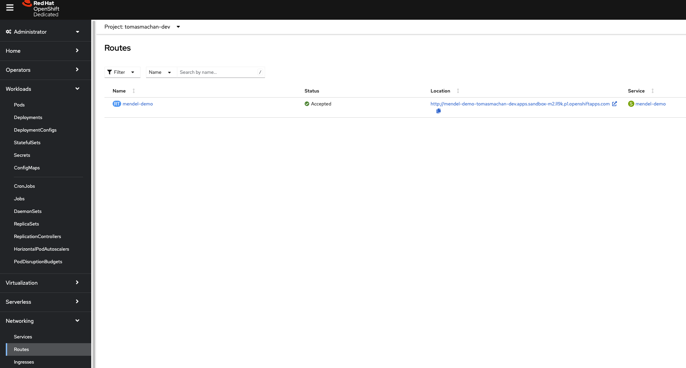

# Simple greeting service on Liberty Profile

Liberty Profile is a flexible server profile of IBM's WebSphere Application Server (WAS) which enables the server to deploy only required custom features rather than deploying all available components.

This repository contains the sample Java application. Below are the instructions how to start in locally and also how to build the container image and deploy it to the cloud (orchestration platform Openshift).

## Run locally

- Prerequisites
  - IDE of any choice - eg. `VSCode` - [download link](https://code.visualstudio.com/) - **approx. 5min**
    - Extensions in order to run below commands - IDE should display suggestions
  - Java related packages like `maven` - [download link](https://maven.apache.org/install.html) - **approx. 5min**
  - `podman` installed using terminal / command line - [download link](https://podman.io/docs/installation) - **approx. 5min**
  - `git` installed - [download link](https://git-scm.com/book/en/v2/Getting-Started-Installing-Git)

### Start in dev mode

```bash
cd app
./mvnw liberty:dev
```

### Package

```bash
cd app
./mvnw clean package
```

## Run in container locally

### Build an application image

```bash
# export BASE_IMAGE=icr.io/appcafe/websphere-liberty:23.0.0.6-kernel-java8-openj9-ubi
export BASE_IMAGE=icr.io/appcafe/open-liberty:full-java8-openj9-ubi
# a build with online access to a feature repository
podman build --platform=linux/amd64 -t greeting:latest --build-arg BASE_IMAGE=$BASE_IMAGE .

# a build with a locally hosted feature repository
podman build --platform=linux/amd64 -t greeting:latest --build-arg BASE_IMAGE=$BASE_IMAGE --build-arg FEATURE_REPO_URL="http://host.containers.internal:8080/23.0.0.6/repo.zip" --build-arg VERBOSE=true .
```

### Run a container

```bash
export GREETINGS="Hello from WebSphere Liberty.;How are you?"
podman run -d --name greeting --rm -p 9080:9080 -e GREETINGS=$GREETINGS greeting:latest
```

- Image referencing deployed application
    

## Run in container on cloud

- Prerequisites
  - [Build an application image](#build-an-application-image) in previous step
  - Openshift sandbox [free instance started](https://developers.redhat.com/developer-sandbox) - **approx. 5min**
    
  - `oc` (Openshift CLI) installed using [web console](https://docs.openshift.com/container-platform/4.14/cli_reference/openshift_cli/getting-started-cli.html#cli-installing-cli-web-console_cli-developer-commands) - **approx. 5min**
  - `Quay` image repository account created - [link](https://quay.io/) - **approx. 5min**
    - Create repository
    - Create robot account - [link](https://docs.quay.io/glossary/robot-accounts.html)

- Upload image to Quay image repository
  - Login to `quay.io`
    - In webUI [Login page](https://quay.io/repository/) - done in prerequisites
    - In terminal locally `podman login quay.io`
  - Upload image named `greeting`
    - Details [here](https://docs.quay.io/solution/getting-started.html)
    - List images - `podman images`
    - List containers - `podman ps -a`
    - Tag a container to an image - `podman commit <container_id> quay.io/username/reponame`
      - eg. `podman commit 2e57fb08c86c quay.io/tomasmachan/mendel_demo`
    - Push the image to `quay.io` - `podman push quay.io/username/reponame`
      - eg. `podman push quay.io/tomasmachan/mendel_demo`
- Deploy the application to the Openshift
  - Login to Openshift from the CLI - details [here](https://docs.openshift.com/container-platform/4.14/getting_started/openshift-cli.html)
  - Create / switch to the project
    - eg. `oc project tomasmachan-dev`
  - Create new app based on our image
    - `oc new-app --docker-image quay.io/tomasmachan/mendel_demo:latest`
  - Observe command line / cluster while the app is being built
    - `oc get deployments`
    - `oc get pods`
    - `oc describe deployment mendel-demo`
  - In order to get URL accessible outside from cluster (non-internal), `route` needs to be built
    - eg. basic `http route` executed by `oc expose service/mendel-demo`
  - Access the application based on the UR from `route` **-> endpoint needs to be added**, see [Endpoints](#endpoints)
    - eg. `http://mendel-demo-tomasmachan-dev.apps.sandbox-m2.ll9k.p1.openshiftapps.com/api/greetings`

- Images referencing deployed application
    
    
    
    

## Endpoints

The `/greetings` endpoint is accessible at `http://<host>:<port>/api/greetings`

## Environment variables

| Env         | Description                        | Default value                          |
| ----------- | ---------------------------------- | -------------------------------------- |
| `GREETINGS` | A list of greetings divided by ";" | `(You did not specify any greetings.)` |
